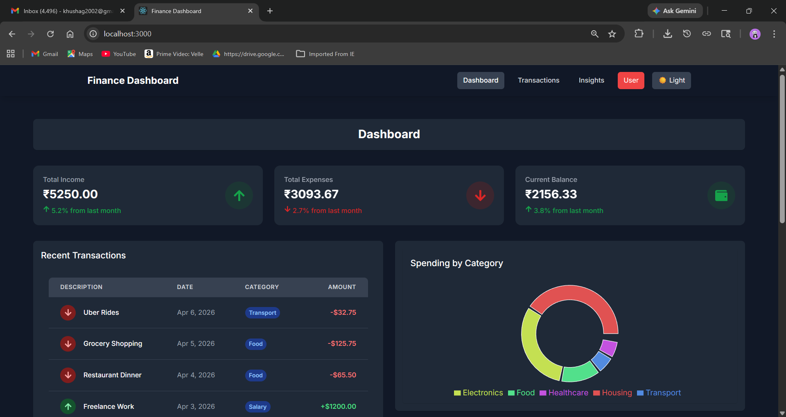
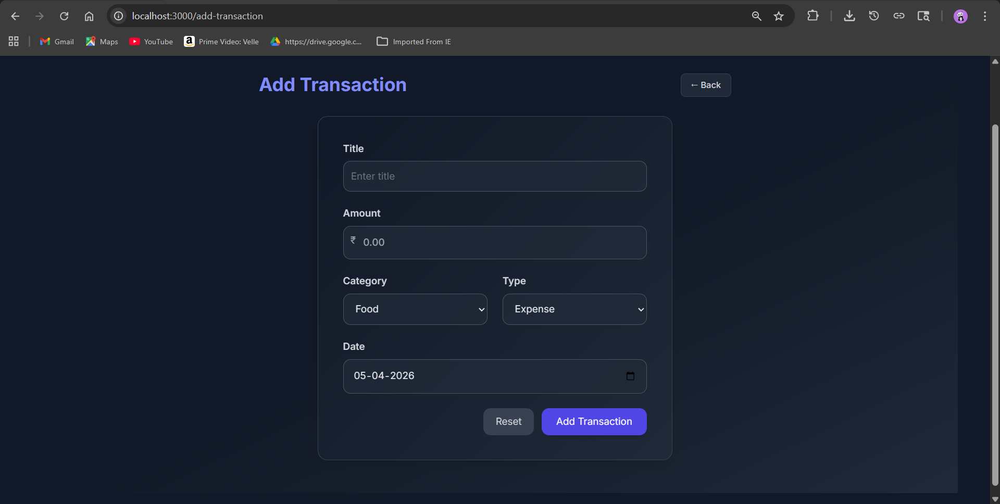
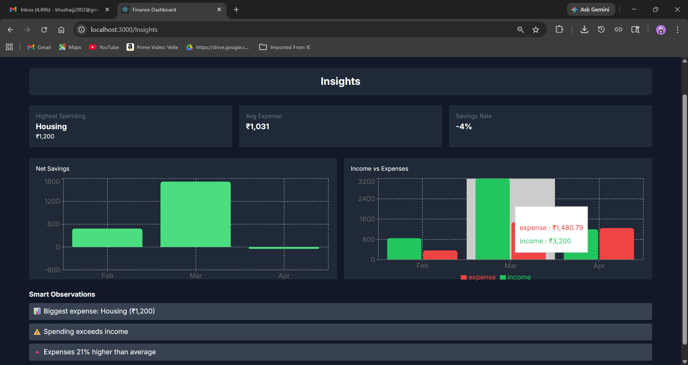
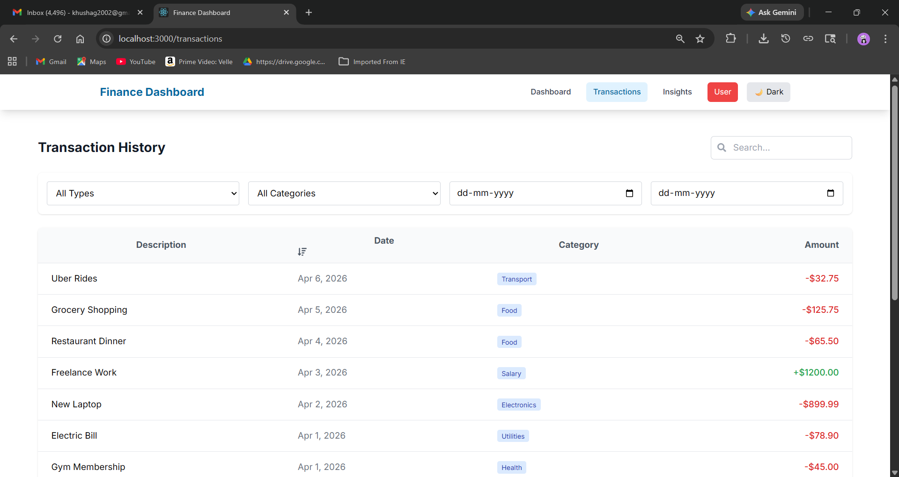

# Finance Dashboard

A modern, responsive finance dashboard built with React.js and Tailwind CSS. This application helps users track their income and expenses with an intuitive interface and beautiful data visualizations.

 ## 🌐 Live Demo

🚀 Try the app here:
👉 https://your-project-name.vercel.app

## ✨ Features

### Dashboard
- Real-time financial summary
- Interactive charts for expense tracking
- Recent transactions overview
- Responsive design for all devices

### Transaction Management
- Add or view  transactions
- Filter and sort functionality
- Categorization of expenses
- Date range filtering

### Data Visualization
- Interactive charts using recharts
- Category-wise spending analysis
- Income vs. Expense comparison

## 🚀 Getting Started

### Prerequisites
- Node.js (v14 or later)
- npm (v8 or later) or Yarn

### Installation

1. Clone the repository:
   ```bash
   git clone <repository-url>
   cd finance-dashboard
   ```

2. Install dependencies:
   ```bash
   npm install
   ```

3. Start the development server:
   ```bash
   npm start
   ```

4. Open [http://localhost:3000](http://localhost:3000) to view it in your browser.

## 🛠️ Available Scripts

In the project directory, you can run:

### `npm start`

Runs the app in development mode.\
Open [http://localhost:3000](http://localhost:3000) to view it in your browser.

### `npm run build`

Builds the app for production to the `build` folder.

## 🚀 Future Enhancements

### Backend Integration
- [ ] **User Authentication**
  - JWT-based authentication
  - Social login (Google, GitHub)
  - User profiles and preferences

- [ ] **Database**
  - MongoDB/PostgreSQL integration
  - Data persistence
  - Backup and restore functionality


- [ ] **Smart Categorization**
  - Automatic transaction categorization using NLP
  - Machine learning for pattern recognition
  - Custom category suggestions

- [ ] **Financial Insights**
  - Predictive analytics for future expenses
  - Budget optimization suggestions
  - Anomaly detection in spending

- [ ] **Voice & Natural Language**
  - Voice-based transaction entry and queries
  - Voice-controlled navigation and reports
  - Natural language financial insights (e.g., "Show me spending trends for groceries last quarter")
  - Conversational AI for financial guidance

- [ ] **Mobile App**
  - React Native version
  - Offline functionality
  - Biometric authentication

- [ ] **Reports & Exports**
  - PDF/Excel report generation
  - Custom report builder
  - Email reports

## 📸 Screenshots

### 📊 Dashboard


### ➕ Add Transaction


### 📈 Insights


### 📜 Transaction History


## 📄 License

This project is licensed under the MIT License - see the [LICENSE](LICENSE) file for details.

## 🙏 Acknowledgments

- [React](https://reactjs.org/)
- [Tailwind CSS](https://tailwindcss.com/)
- [React Icons](https://react-icons.github.io/react-icons/)
This project is open source and available under the [MIT License](LICENSE).

---

Built  by [KHUSHI AGRAWAL]
